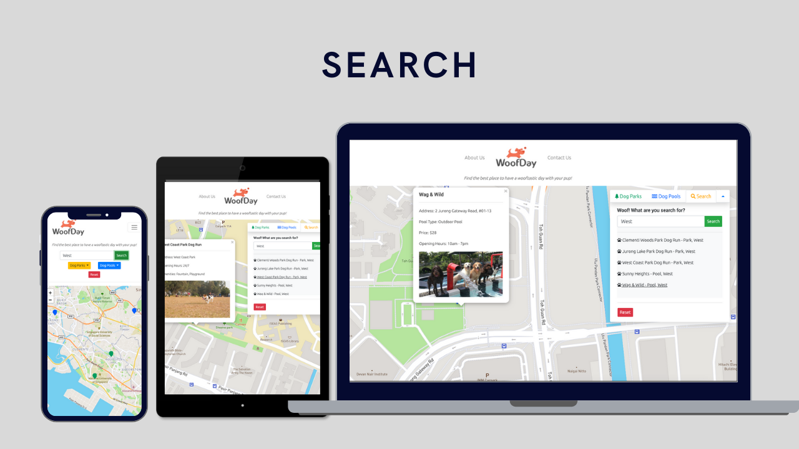

## woofday

### Site Owner Goals and Target Audience
As a dog owner, it is hard to be able to easily find all the places you can bring your furry friends to play over throughout the week. Therefore came the concept behind this interactive map and finder web app, where users can easily identify the different dog parks and dog pools in Singapore, and can easily find the closest location of where they would like to go.

The live demo website can be accessed here: 

## UI / UX
### Objectives
For the UI / UX of this app, is to keep it simple, clean and easy to use. After narrowing down the different criteria that the user story mentions, the web app makes sure that the user should be able to easily search and filter by the different parks and pool locations, to plan for their trip with their dog. 

### User Stories
> 1. The information on Google and Google maps are not always right, I have been to the location listed and it was wrong
> 2. It is easier to have it all categorized in one place.
> 3. Some of the parks that search engine provides are normal parks and not actual dog parks, some which dogs are not allowed there.
> 4. It is so hard to search how much the different prices for the pools are and it takes a long time to do so.
> 5. I don't know how many dog pools there are actually in Singapore so I have never brought my dog there before.

## Scope 
_Functional Specifications_
* Search for Dog Parks and Dog Pools
* Filter between different categories within Dog Parks and Dog Pools
* Show all the details through the map of the different park and pools

_Content requirements_
* Information and details about Dog Parks
* Information and details about Dog Pools
* Data of all the information

_Non-functional requirements_
* Mobile responsiveness
* Performance

## Structure 
### Content Info
This is a one page app website that is split into a few different sections, the navbar, map, function tabs.

### Map
In the map section, there is the function tab that is on the side which is then organized into three different tabs that will be further explained below.
There are different markers on the map that are separated in to two different cluster layers.

### Search

* With the results, users has the option to click on the result they want and it will lead them to the marker, zoomed in on the map.
* Upon clicking the markers, details of the parks and pools will be displayed, including the images.
* Users can remove all previous search layers by clicking on the reset button.
* Users can search and explore more in this search bar.

### Filter

* Users can switch between the "Dog Parks" and the "Dog Pools" tabs to choose the different filters.
* Under the category of Dog Parks, the regions and amenities can be filtered.
* Under the category of Dog Pools, the regions and types of pools can be filtered.

## Mobile Responsiveness
The web app is mobile responsive and adjusted according to the different sizes of the screen. Due to the map being the main part of the app, some elements of the map, such as the collapsible tab has to be taken away from the map in a mobile version. Another type of search bar was issued instead.

## Layer

### Collapsible Tab
* This tab is collapsible to ensure that the map can be easily read after the user searches or filters different items.

### Colors
* Triadic color combination was used to separate the three different categories to be easily identifiable to the user
* Everything under parks, the color green was used as this relates the most to the term "park", it was also a different shade as not to clash with the map colors.
* Everything under pools, the color blue was used as this relates the most to the term "pool", this shade of blue was also used to differenciate easier from the routes in the map.
* Button colors, green was used for filter and search that related to "go". Red was used for reset and that related to "stop".

### Typography
* sans-serif font (Ubuntu and Roboto) were used to keep it clean and simple to use and have a contrast with the brand logo
* Font size is set to adjust according to the different device size, easier to read and understand

### Map Icon
* Instead of the marker that came with leaflet, the icon used was more solid, and the color is the same as the info side bar, and categorized by parks and pools.

## Testing

|Category|Input / Actions|Output / Errors
|Overall|Mobile Responsive|No error|
|Nav Bar|About Us|Modal popup opens and closes|
|Nav Bar|Contact Us|Modal popup opens and closes, user must enter name and contact, or else an alert will popup|
|Map|On load / Click|All markers and details shown|
|Info Side Bar|Mobile Responsive|No error, disappears on smaller devices and changes into a row under the navbar instead|
|Info Side Bar|Tabs switching|Different tabs show and can be easily switched|
|Info Side Bar|Search|Can search on click or enter, results will be list out|
|Info Side Bar|Search Results|Results can be clicked and will zoomed into the particular marker and map view|
|Info Side Bar|Filter|All checkboxes can be clicked and filtered upon clicking|
|Info Side Bar|Reset Button|Everything resets, map, checkboxes and searchbar|

## Technology
* HTML
* CSS
* Javascript
* [LeafletJS](https://leafletjs.com/) use for map and popups
* [axios](https://github.com/axios/axios) for getting the data from the json file data
* [Bootstrap](https://getbootstrap.com) for main layout design, navbar, toggle tabs
* [Fontawesome](https://fontawesome.com/) for the different webpage and map icons
* [Canva](http://www.canva.com) for the color theme and the mockup images for different devices

## Deployment 
This web app is hosted using Netlify.

**Steps for deployment:**
1. All edits were added, commited, and pushed to GitHub via Gitpod.
2. Go to https://www.netlify.com/ and log in with Github account.
3. Click on "New site from Git" button
4. Select "GitHub" for continuous deployment
5. Authorize access to GitHub should a pop-up appear
6. Select the repository that you want to deploy
7. Click on "Deploy site" button to get a link for the deployed site

## Credits

* [pexels](https://www.pexels.com) for all the dog park and pool pictures used
* [squadhelp](squadhelp.com) for the brand logo and name
* Deployed through instructions from [TGC's deployment guide](https://docs.google.com/document/d/1f_aYsk4qqjYjkrWMOK5E2wS6hlasZL-ov7Q05ccSv9c/edit?usp=sharing)
